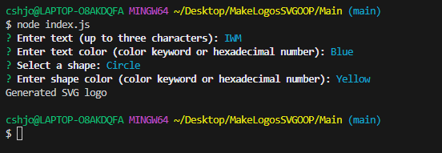
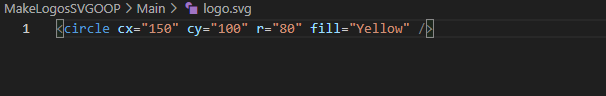

# MakeLogosSVGOOP

## description : 

Using an inquirer prompt, users can input data into the application to create a "logo.svg" file that provides the required results as an SVG graphic.

## challenges : 
Something I found difficult was making a non-deployed application that uses the command line tool "node index.js" to create a logo and save it as an SVG file.
after getting everything compiled and running many tests / background research with stack overflow i was able to utilize OOP and the previous class material to get the code functioning

## Tools used : 

Inquirer 
Node.js
OOP
Jest
Visual Studio Code

## Screenshots

## video 

https://app.screencastify.com/v3/watch/K27A5hCFjHV2nO0eFHQx

